# 🛒 Quicklist — Lista de Compras  

  

Projeto desenvolvido como parte do **Desafio da Formação Full-Stack da Rocketseat**.  
O objetivo é criar uma aplicação simples e prática de **lista de compras**, onde o usuário pode **adicionar** e **remover itens** dinamicamente.

---

## 🎨 Design (Figma)

Protótipo disponível no Figma:  
👉 [Acessar no Figma](https://www.figma.com/design/5IILQleRRBr8h8keMDY8Qy/Lista-de-compras--Community-?node-id=3-376&p=f&t=Eiqoqn6XnioI8ATy-0)

---


## ✨ Funcionalidades  

- ➕ **Adicionar item** à lista de compras.  
- 🗑️ **Remover item** da lista de compras.  
- ✅ Marcar itens como concluídos (checkbox).  
- 🔔 Exibir **notificação (toast)** ao remover um item.  

---

## 📚 Aprendizados  

Durante o desenvolvimento dessa aplicação, foram trabalhados os seguintes conceitos:  

- **JavaScript**  
- **Funções**  
- **Manipulação da DOM**  
- **Eventos**  

---

## 🛠️ Tecnologias Utilizadas  

- **HTML5**  
- **CSS3**  
- **JavaScript (ES6+)**  

---

## 🚀 Como executar o projeto  

1. Clone o repositório:  
   ```bash
   git clone https://github.com/seu-usuario/quicklist.git
